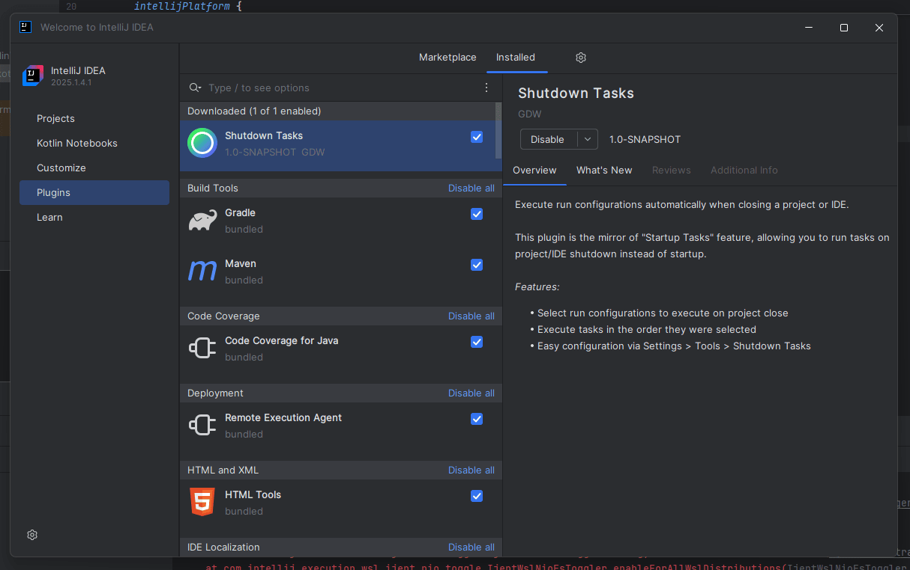
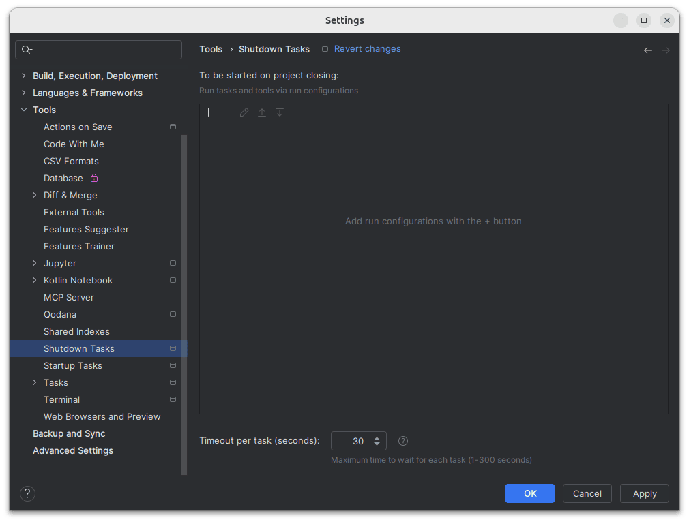
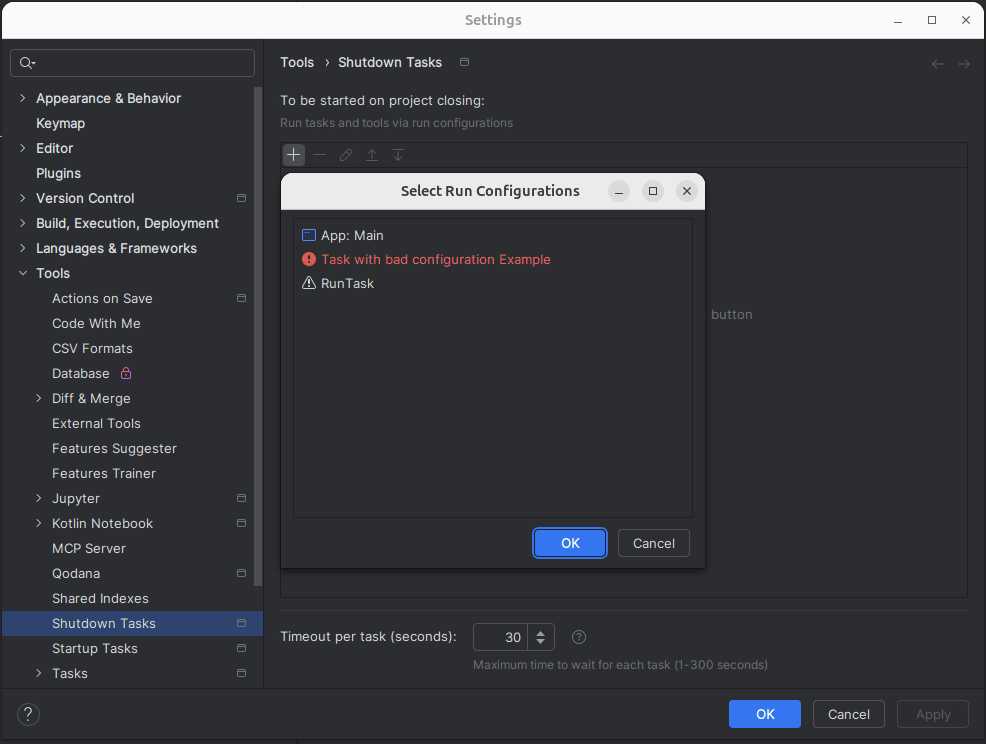
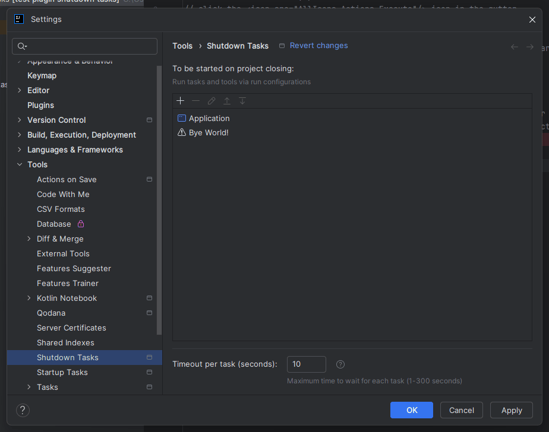
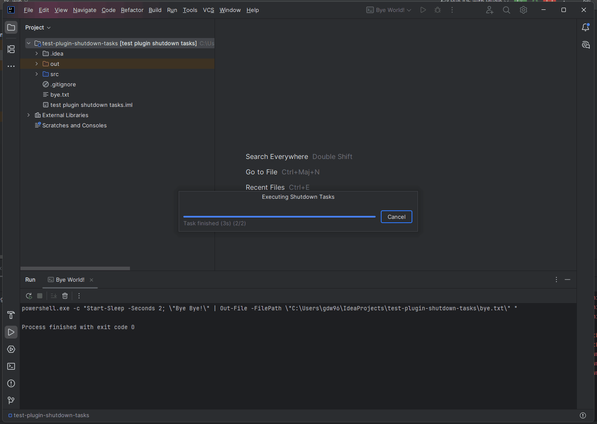

# Shutdown Tasks Plugin


Execute run configurations automatically when closing a project or IDE - the mirror feature of IntelliJ's built-in "Startup Tasks".

## Table of Contents

<!-- TOC -->
* [Shutdown Tasks Plugin](#shutdown-tasks-plugin)
  * [Table of Contents](#table-of-contents)
  * [Features](#features)
    * [🚀 Automated Task Execution](#-automated-task-execution)
    * [🎨 User-Friendly Interface](#-user-friendly-interface)
    * [🔍 Smart Configuration Tracking](#-smart-configuration-tracking)
  * [Installation](#installation)
    * [From JetBrains Marketplace (Recommended)](#from-jetbrains-marketplace-recommended)
    * [Manual Installation](#manual-installation)
    * [Build from Source](#build-from-source)
  * [Usage](#usage)
    * [Basic Setup](#basic-setup)
    * [Example Configurations](#example-configurations)
      * [Stop Development Server (Shell)](#stop-development-server-shell)
  * [Use Cases](#use-cases)
    * [Development Workflow](#development-workflow)
    * [Deployment & CI/CD](#deployment--cicd)
    * [Resource Management](#resource-management)
  * [Screenshots](#screenshots)
  * [Configuration Files](#configuration-files)
  * [Important Notes](#important-notes)
    * [When and How Tasks Execute](#when-and-how-tasks-execute)
    * [Why Full Timeout sometimes?](#why-full-timeout-sometimes)
    * [Task Execution During Shutdown](#task-execution-during-shutdown)
    * [Best Practices](#best-practices)
  * [Troubleshooting](#troubleshooting)
    * [Tasks Don't Execute](#tasks-dont-execute)
    * [Task Fails Silently](#task-fails-silently)
    * [Cannot See Task Progress](#cannot-see-task-progress)
  * [Development](#development)
    * [Requirements](#requirements)
    * [Building](#building)
    * [Project Structure](#project-structure)
  * [Contributing](#contributing)
  * [License](#license)
  * [Support](#support)
  * [Acknowledgments](#acknowledgments)
<!-- TOC -->

## Features

### 🚀 Automated Task Execution
- Run any configured run/debug configuration when closing your project
- Tasks are executed in the order you define
- IDE waits for each task to complete
- Configurable timeout per task (1-300 seconds)
- Visual progress dialog with real-time status
- ✅ Task output visible in Run tool window
- Cancel anytime during execution

### 🎨 User-Friendly Interface
- Intuitive configuration panel in **Settings → Tools → Shutdown Tasks**
- Visual task list with configuration icons
- Add/Edit/Remove and Reorder tasks easily

### 🔍 Smart Configuration Tracking
- Automatically follows configuration renames
- Never loses track of your tasks

## Installation

### From JetBrains Marketplace (Recommended)
1. Open **Settings/Preferences → Plugins**
2. Search for "Shutdown Tasks"
3. Click **Install**
4. Restart IDE

### Manual Installation
1. Download the latest release from [Releases](https://github.com/gdw96/shutdown-tasks/releases)
2. Open **Settings/Preferences → Plugins**
3. Click ⚙️ → **Install Plugin from Disk...**
4. Select the downloaded `.zip` file
5. Restart IDE

### Build from Source

```bash
git clone https://github.com/gdw96/shutdown-tasks.git
cd shutdown-tasks
./gradlew buildPlugin
```

## Usage

### Basic Setup

1. **Open Settings**
    - `File → Settings` (Windows/Linux)
    - `IntelliJ IDEA → Preferences` (macOS)
    - Or press `Ctrl+Alt+S` / `⌘+,`

2. **Navigate to Shutdown Tasks**
    - `Tools → Shutdown Tasks`

3. **Add Tasks**
    - Click the **+** button
    - Select one or more run configurations
    - Click **OK**

4. **Set Timeout** (Only in synchronous mode)
    - Default: 5 seconds per task
    - Range: 1-300 seconds
    - ⚠️ **Important:** The IDE will wait for the total duration of the timeout for each task where it is impossible to monitor execution.

5. **Reorder Tasks** (Optional)
    - Use ▲ / ▼ buttons to change execution order

6. **Apply Changes**
    - Click **Apply** or **OK**

### Example Configurations

#### Stop Development Server (Shell)

```bash
#!/bin/bash
echo "Stopping development server..."
pkill -f "node.*server.js"
echo "Server stopped"
exit
```
**Configuration:**
- Type: Shell Script
- Script: `stop-server.sh`
- Execution mode: Synchronous
- Timeout: 5 seconds
- Execute in the terminal: Unchecked ⚠️ **Important**

## Use Cases

### Development Workflow
- **Cleanup temporary files** after each session
- **Stop background services** (databases, servers, containers)
- **Archive logs** or debug information
- **Commit/Stash/Push changes** automatically

### Deployment & CI/CD
- **Trigger builds** on project close
- **Update documentation** automatically

### Resource Management
- **Close connections** to remote servers
- **Release file locks** or temporary resources
- **Stop Docker containers** or VMs
- **Cleanup memory-intensive processes**

## Screenshots







## Configuration Files

Shutdown Tasks configuration is stored in `.idea/workspace.xml`.

## Important Notes

### When and How Tasks Execute

**Project Closing** (`File → Close Project`):
- ✅ Tasks execute with progress dialog visible
- ✅ You can see and cancel execution
- ✅ IDE waits for tasks if "Wait for completion" is enabled

**IDE Closing** (`File → Exit` or close window):
- ✅ Tasks execute automatically (projects close triggers them)
- ⚠️ **No progress dialog shown** (IDE closes immediately)
- ⚠️ Tasks run in background during shutdown
- 💡 **Tip:** Use "Close Project" first if you want to monitor tasks

**Recommendation:**
- Use `File → Close Project` to see progress

### Why Full Timeout sometimes?
Due to IntelliJ Platform limitations, the plugin cannot reliably detect when a task completes.

Therefore:
- Tasks are launched and visible in the Run tool window
- The progress dialog waits for the configured timeout
- After timeout, the IDE continues closing

### Task Execution During Shutdown
- Tasks execute in **sequential order** (one after another)
- Failed tasks don't prevent subsequent tasks from running
- Task output is **always visible** in the Run tool window
- Errors are logged to `idea.log`

### Best Practices
1. ✅ **Keep tasks short** - Users expect quick shutdown
2. ✅ **Test your tasks** before adding to shutdown
3. ✅ **Set realistic timeouts** - slightly longer than task duration
4. ✅ **Handle errors gracefully** in your scripts
5. ⚠️ **Avoid interactive tasks** - No user input during shutdown

## Troubleshooting

### Tasks Don't Execute
**Problem:** Tasks configured but nothing happens on project close.

**Solutions:**
- Check if tasks are enabled in Settings
- Verify run configurations still exist
- ⚠️ Please verify that the “Shell Script” _(or other)_ tasks do not have the “Run in the terminal” option selected.
- Check `idea.log` for errors (`Help → Show Log in Explorer/Finder`)

### Task Fails Silently
**Problem:** Task configured but appears to do nothing.

**Solutions:**
- Test the run configuration manually first
- Check task output in Run tool window
- Verify script paths and permissions
- Add error handling to your scripts

### Cannot See Task Progress
**Problem:** Want to see what tasks are doing.

**Solutions:**
- ⚠️ Please verify that the “Shell Script” _(or other)_ tasks do not have the “Run in the terminal” option selected.
- Check Run tool window tabs for each task's output
- ¯⁠\⁠_⁠(⁠ツ⁠)⁠_⁠/⁠¯

## Development

### Requirements
- IntelliJ IDEA 2025.2+ or compatible IDE
- JDK 21+
- Gradle 8.14+

### Building

```bash
# Build plugin
./gradlew buildPlugin

# Run in development IDE
./gradlew runIde

# Run tests
./gradlew test
```

### Project Structure
```
shutdown-tasks/
├── src/main/kotlin/dev/gdw/shutdowntasks/
│   ├── listeners
│   │   └── ShutdownTasksProjectCloseListener.kt                 # Project close listener
│   ├── services
│   │   └── ShutdownTasksRunnerService.kt                        # Task executor
│   ├── settings
│   │   └── ShutdownTasksState.kt                                # State persistence
│   ├── ui
│   │   ├── RunnerAndConfigurationSettingsListCellRenderer.kt    # UI renderer
│   │   ├── RunnerAndConfigurationSettingsSelectionDialog.kt     # Task selection dialog
│   │   └── ShutdownTasksConfigurable.kt                         # Settings UI
│   └── utils
│       └── RunnerAndConfigurationSettingsUtils.kt               # RunnerAndConfigurationSettings Utility
├── src/main/resources/META-INF/
│   ├── plugin.xml                                               # Plugin descriptor
│   └── pluginIcon.svg                                           # Plugin icon
├── build.gradle.kts                                             # Build configuration
└── README.md
```

## Contributing
Contributions are welcome! Please:
1. Fork the repository
2. Create a feature branch (`git checkout -b feature/amazing-feature`)
3. Commit your changes (`git commit -m 'Add amazing feature'`)
4. Push to the branch (`git push origin feature/amazing-feature`)
5. Open a Pull Request

## License
This project is licensed under the MIT License - see the [LICENSE](LICENSE) file for details.
## Support
- 🐛 **Bug Reports:** [GitHub Issues](https://github.com/gdw96/shutdown-tasks/issues)
- 💡 **Feature Requests:** [GitHub Issues](https://github.com/gdw96/shutdown-tasks/issues)

## Acknowledgments
- Inspired by IntelliJ IDEA's built-in "Startup Tasks" feature
- Built with [IntelliJ Platform Plugin SDK](https://plugins.jetbrains.com/docs/intellij/)

Made with ❤️ by [GDW](https://github.com/gdw96)